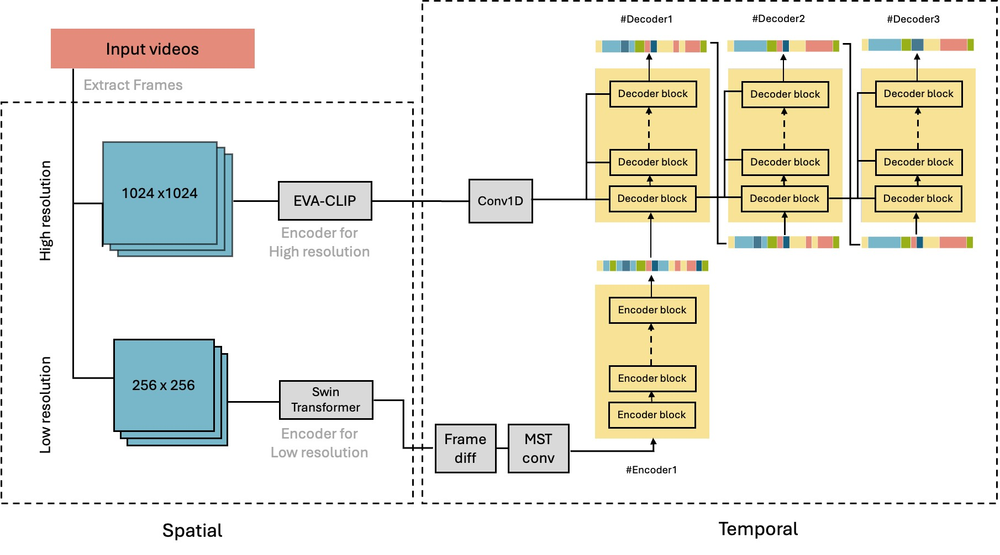

GUI-ASFormer: Detecting Keyframes in GUI Videos
===

This repository provides the implementation of our paper: GUI-ASFormer: Detecting Keyframes in GUI Videos. The code enables users to reproduce and extend the results of our method.

## Overview

This project extends the action segmentation framework from the BMVC 2021 paper [ASFormer: Transformer for Action Segmentation](https://arxiv.org/pdf/2110.08568.pdf).  We adapt the architecture to specifically address the unique challenges of GUI video segmentation. The structure of our proposed model is shown below:



## Enviroment

Pytorch == `2.5.0`, python == `3.11`, CUDA=`12.6`

> We recommend using a virtual environment or conda environment for clean setup.

## How to Use

### Download Dataset

Download the preprocessed website videos from GUI-World [here](https://drive.google.com/drive/folders/1-23Y5hMKLQrkTv0iVelz0xE0_zfQdMTr?usp=drive_link).

We provide features extracted using Swin Transformer, EVA2-CLIP-L, and I3D. The dataset splits used in our experiments are also included.

Expected folder structure:

```
./data/website
├── features_swin/          # NPY files
├── features_eva/           # NPY files
├── groundTruth/            # TXT files
├── splits/                 # train/test bundles
└── mapping.txt             # action to id to mapping
```


### Train Model

After setting up your data, run the following to train the model:

```
python main.py --action=train --dataset=website --split=1/2/3/4/5
```

In our paper, we run with the following default settings:

* `--num_epochs=120`
* `--num_layers=10`
* `--num_decoders=3`

You can customize these based on your experiment.

We provide pretrained models [here](https://drive.google.com/drive/folders/140lqoxeChh9FjE9zIEQ1yJA22wSJ37uO?usp=drive_link).

### Inference

Run inference with a trained or downloaded model:

```
python main.py --action=predict --dataset=website --split=1/2/3/4/5 --model_name={model_name} --mode=best/last
```

Predictions are saved in the `./results/` directory.

### Evaluation

Evaluate prediction results using:

```
python eval.py --dataset=website --split=1/2/3/4/5 --stage=0/1/2/3
```

This computes F1@{10, 25, 50}, edit distance, and frame-wise accuracy.

## Using Your Own Dataset

Want to train on your own GUI dataset? We provide tools to help:

* Feature extraction pipeline: `./embedding/`
* Annotation processing: `./annotation/`
(especially useful for working with other subsets of GUI-World)

You're brave — good luck!


## Acknowledgement

This project was developed as part of EECS 545: Machine Learning at the University of Michigan.

Please note that this project is subject to the University [Honor Code Policy](https://ecas.engin.umich.edu/honor-council/honor-code/). If you use this code or reference this work, please cite the original paper appropriately.